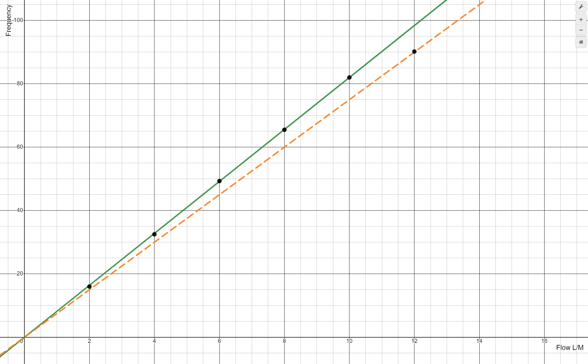
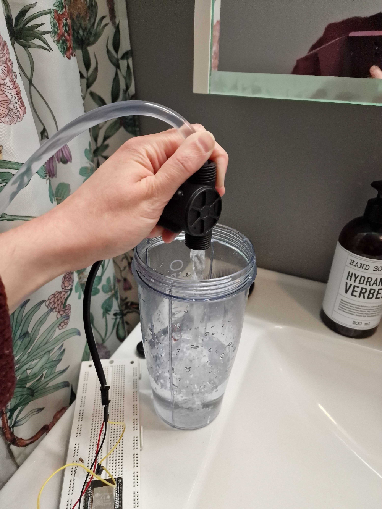
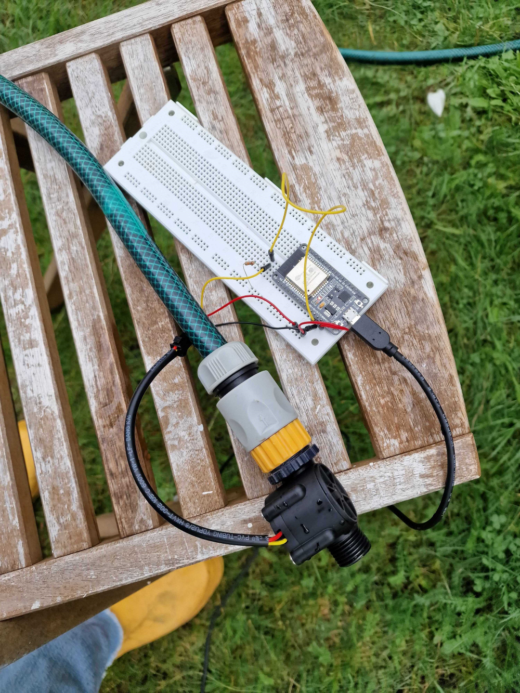
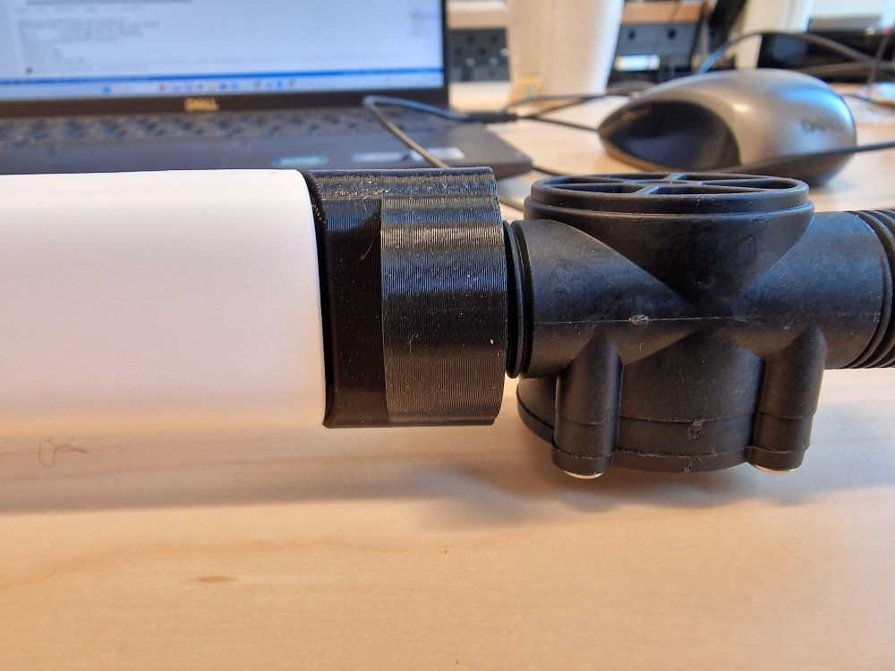

# YF-S201 tests

Below is a summary of [Sensor informmation](https://components101.com/sensors/yf-s201-water-flow-measurement-sensor) found online.
|Flow(L/H)|Frequency(Hz)|
---|---
|120|16|
|240|32.5|
|360|49.3|
|480|65.5|
|600|82|
|720|90.2|

Green line: Frequency = Flow x 8.2

Orange line: Frequency = Flow x 7.5
## Water through sensor using a funnel

| Water poured (L) | Water measured (L) | Pulse flow formula     |
|------------------|--------------------|------------------------|
| 0.75             | 0.63               | Frequency = Flow x 7 |
| 0.75             | 0.5                | Frequency = Flow x 8 |

Funnel is to big and water can't be poured without spilling

## Test with hose

Frequency = Flow x 8. Measure pulse s for 1 s at a time. The sensor was attatched to a hose. Around 25 L of water was poured. Sensor reported 20.58 L.

###  Frequency = Flow x 7

7.5 is the recomended value according to google, due to a misstake were I used "int" instead of "float" we use the value 7.
doing several tests to see cositancy. The fact that Im pumping a very small amount each try could throw the ressults off, I assume the flow is more inconsistant in the begining and end of each pour.
while measuring I am holding the meater and the hose together with my hand. A lot can vary between each test, this could affect the dramatic difference between results.

| Water poured (L) | Water YF-S201 (L) | YF-S201/poured |
|------------------|--------------------|------------------------|
| 0.75             | 0.38               | 0.5067 |
| 0.75             | 0.8                | 1.067 |
| 0.75             | 0.4                | 0.5333 |
| 0.75             | 0.77               | 1.027 |
| 0.75             | 1.53               | 2.04 |
| 0.75             | 0.78               | 1.04 |
| 0.75             | 0.8                | 1.067 |
| 0.75             | 0.47               | 0.6267 |
| 0.75             | 0.4                | 0.5333 |
| 0.75             | 0.8                | 1.067 |

| Mean YF-S201/poured | Standard deviation YF-S201/poured |
|------|--------------------|
|0.9508  | 0.45               |

#### Several tests with larger volumes of water

For these tests, exept for pouring more water each test, a hose is attatched to the sensor using an adapter. This could also affect the consitancy of the results. 

| Water weight (kg) | Water YF-S201 (L) | YF-S201/weighed |
|-------------------|--------------------|--------------------------------|
| 9.4               | 8.68               | 0.9234                         |
| 9.9               | 9.3                | 0.9394                         |
| 10.7              | 9.98               | 0.9327                         |
| 10.7              | 10.02              | 0.9364                         |
| 9.6               | 9.10               | 0.9479                         |
| 9.7               | 9.08               | 0.9360                         |
| 10.2              | 9.63               | 0.9441                         |
| 9.8               | 9.25               | 0.9439                         |
| 10.2              | 9.65               | 0.9461                         |
| 10.2              | 9.38               | 0.8933                         |

| Mean YF-S201/weighed | Standard deviation YF-S201/weighed | STD/mean|
|------|--------------------|-----------|
|0.93432  | 0.016152317     | 0.01728777827 |

For larger volumes of water, the STD is a lot smaller. The measured values deviate more than one STD from the expected value, this indicates that adjustments to the code could make the results of the measurements better.

#### Weighthed results

For this attempt, the measurements are weighted according to the results from the previous test. The mean value of the measurements for 1 liter of water was 0.93432 so the results will be weighed with a factor of 1/0.93432 = 1.0753
Five volumes of water are measured. It seams like the factor is to large. The setup is slightley different from the previous test, this could explain the difference. These results could be a hint that individual allibrations are needed for each new setup. The STD for these test runs is 1.5 % of the mean, for the previous test it was 1.7 %. We cant say if this has an explanation, or if its coincidence. The way this test is set up, the hose and the meater are manipulated less between tests, this could be a reason to expect a smaller standard deviation.   

| Water weight (kg) | Water measured (L) | Water(measured)/Water(weighed) |
|-------------------|--------------------|--------------------------------|
| 8,6               | 8.92               | 1.037                          |
| 8.6               | 8.71               | 1.013                          |
| 9.5               | 9.93               | 1.045                          |
| 9.9               | 10.37              | 1.048                          |
| 9.9               | 10.42              | 1.052                          |

| Mean YF-S201/weighed | Standard deviation YF-S201/weighed | STD/mean|
|------|--------------------|----------|
|1.039  | 0.01554027   | 0.01495694898 |
## Attempt with vacume cleaner

The sensor is attatched to a vacuumecleaner using a 3D printed adapter designed by Arthur Courant. Unfourtionetley the vacume was to strong for the sensor.

